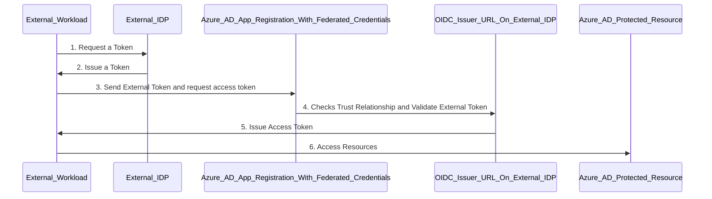

## Git Hub Action OIDC and Azure Workflow Identity Federation Demo

This demo is done using GitHub Open ID Connect Provider as Idp and Setup a Trust with Azure AD App

## Work Identity Federation Architecture




## Reference

Reference: https://docs.microsoft.com/en-us/azure/app-service/deploy-github-actions?tabs=openid#code-try-2

## 

### Steps to Register an App for OIDC in Azure AD

```markdown
Syntax highlighted code block

- 1. az ad app create --display-name gh_action
- 2. az ad sp create --id $appId (appId Received from Step 1)
- 3. az role assignment create --role contributor --subscription $subscription_id --assignee-object-id  $objectId --assignee-principal-type ServicePrincipal (Use objectId Received from Step 2 Not Step 1. Many confuse this step. Very Important)
- 4. az rest --method POST --uri 'https://graph.microsoft.com/beta/applications/$appId/federatedIdentityCredentials' --body '{"name":"az-dev-credentials","issuer":"https://token.actions.githubusercontent.com","subject":"repo:DigitalCodeScience/github-action-openid-deployment:environment:terraform-dev1-plan-apply","description":"terraform-dev1-plan-apply GitHub Action Workflow","audiences":["api://AzureADTokenExchange"]}'

```